# Figure gallery

GitHub displays image folders as a file list rather than as Windows-style thumbnails. This page renders every PNG directly while keeping the `Figures/` directory flat and simple.

[Back to the financial report](../README.md)

## Q1 - Global energy mix

### Figure 01 - Global energy mix

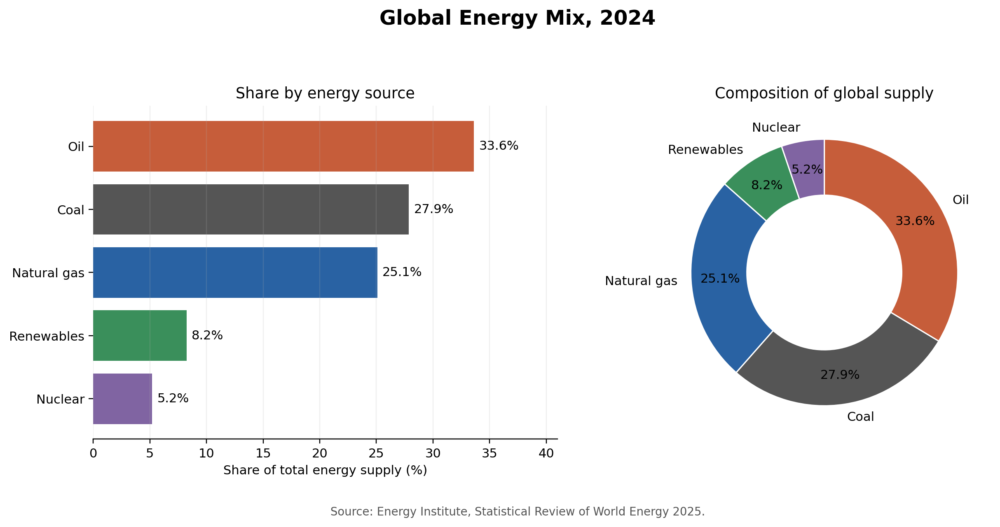

## Q2 - Oil production, consumption and concentration

### Figure 02 - Largest producers and consumers

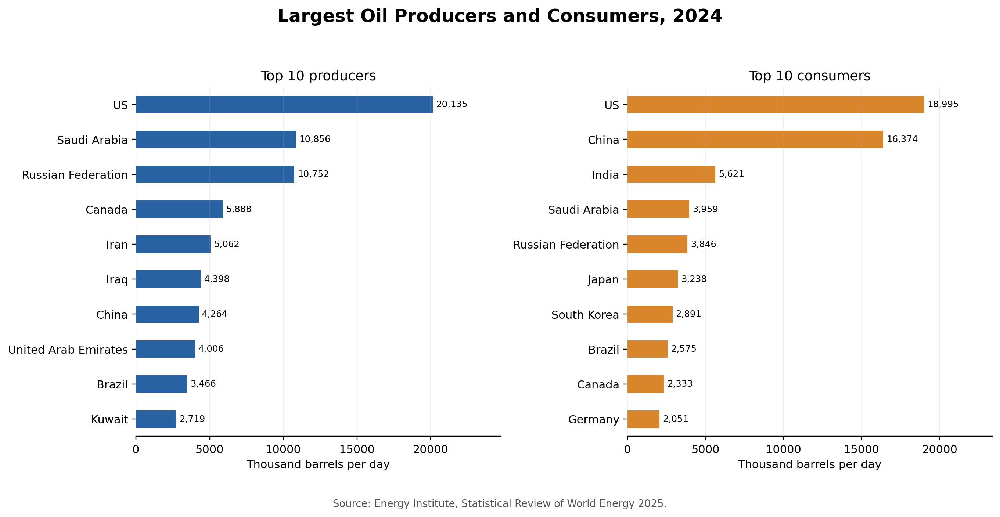

### Figure 03 - Regional production and consumption shares

### Figure 04 - Oil-market concentration

## Q3 - Selected-market energy structure

### Figure 05 - Total energy supply

### Figure 06 - Energy supply by source

### Figure 07 - Energy mix shares

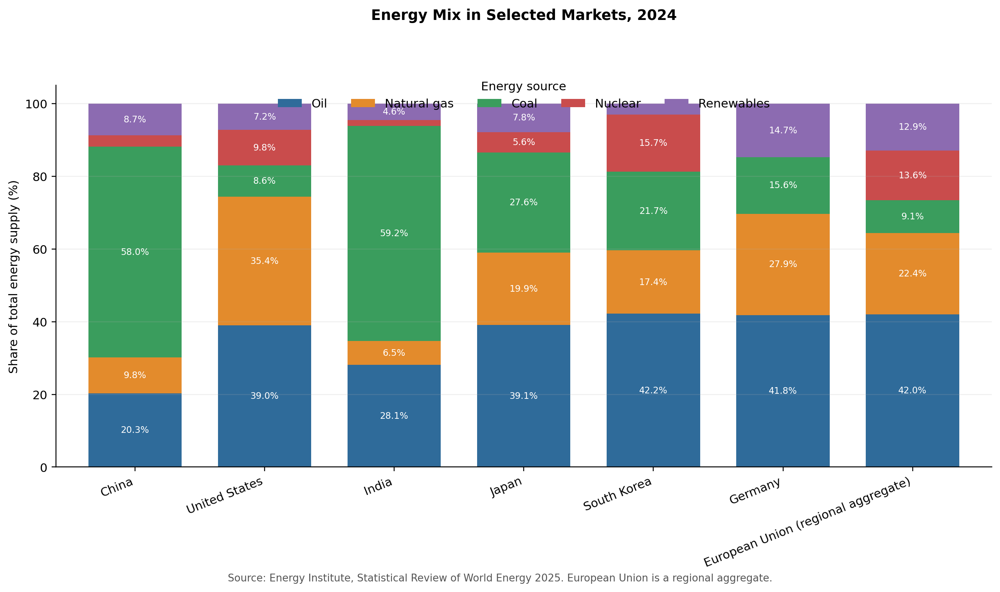

## Q4 - Import-origin and supply-gap screens

### Figure 08 - Selected-exporter origin share

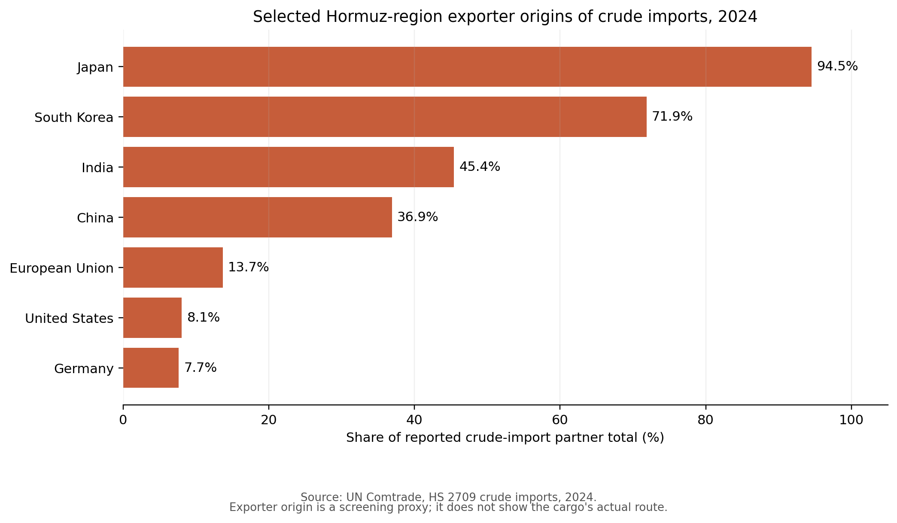

### Figure 09 - Selected Middle East exporter-origin share

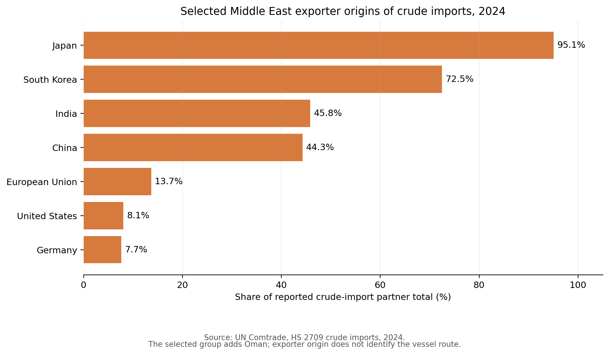

### Figure 10 - Selected Middle East versus Hormuz-region origins

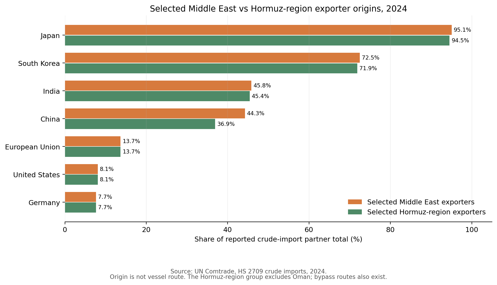

### Figure 11 - Crude-import exporter mix

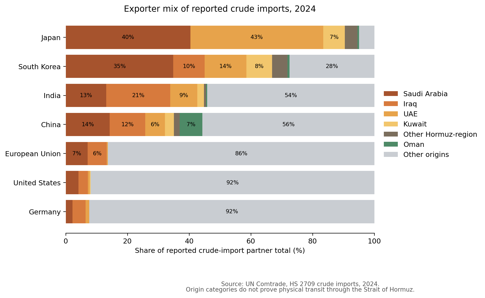

### Figure 12 - Domestic supply-gap proxy

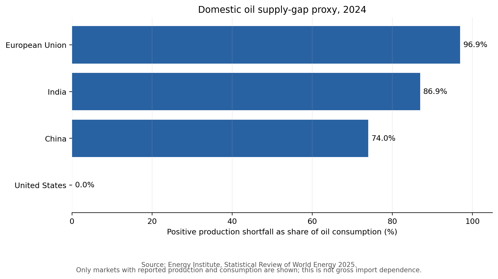

## Q5 - Direct chokepoint flows

### Figure 13 - Major global oil routes

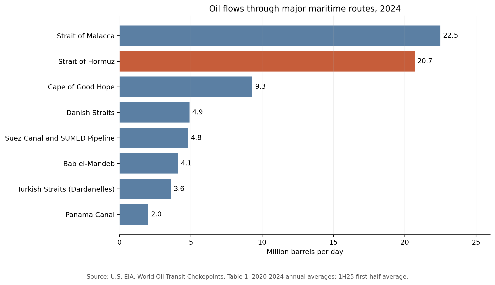

### Figure 14 - Hormuz flow history

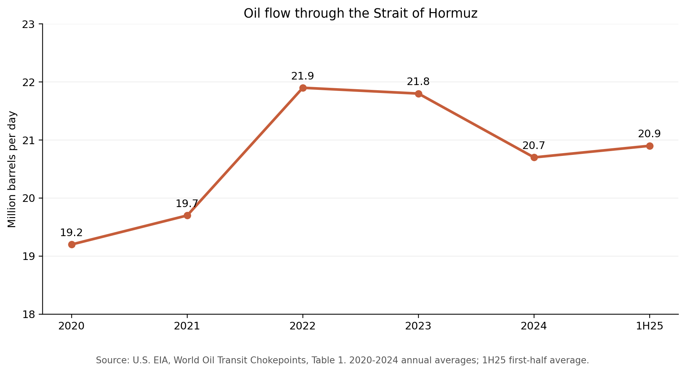

### Figure 15 - Hormuz share of global oil flows

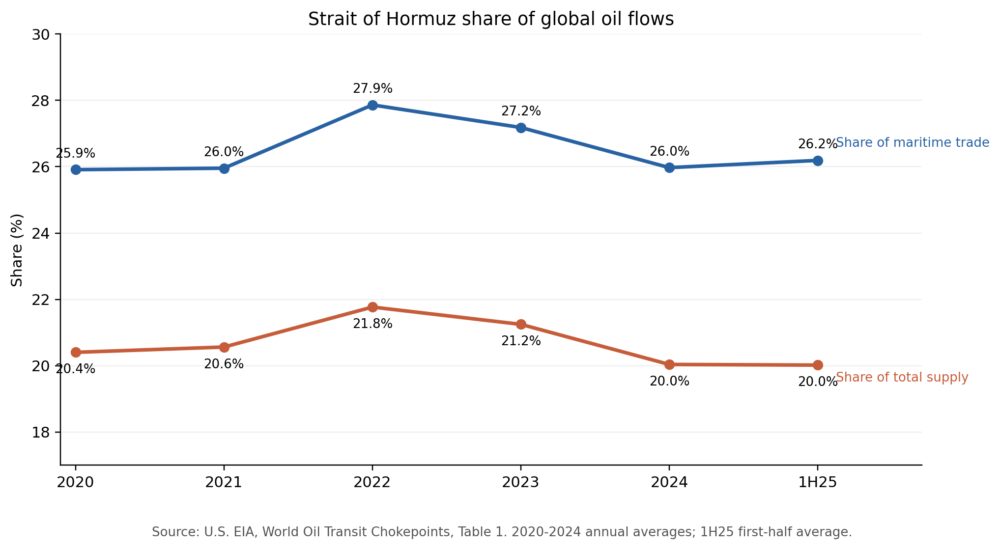
