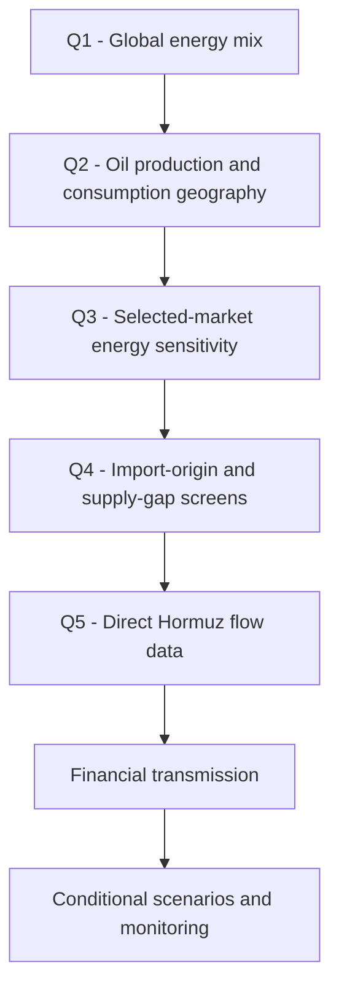

# Strait of Hormuz: Oil-Market Exposure and Financial Transmission

*Python energy-risk case study | 2024 cross-sectional data; EIA flow data through 1H25*

> Educational portfolio project. This is a structural exposure study, not an investment recommendation or an oil-price forecast.

## 1. Project task

The task is to assess whether the Strait of Hormuz is a material structural risk to the global oil market, identify the demand centres with the greatest exposure, and explain how a disruption could transmit into financial markets.

The project answers five questions with five Python scripts:

| Question | Analysis | Main output |
|---|---|---|
| Q1. How important is oil in the global energy system? | Global energy mix | Figure 01 |
| Q2. Where are oil production and consumption separated? | Country rankings, regional balance and concentration | Figures 02-04 |
| Q3. Which large markets are most oil-sensitive? | Total energy supply and energy mix | Figures 05-07 |
| Q4. Which selected importers have concentrated exporter origins? | Crude-import origin and domestic supply-gap screens | Figures 08-10 |
| Q5. How large and persistent are Hormuz flows? | Direct EIA chokepoint data | Figures 11-13 |

All 13 code-generated charts can also be viewed in the [figure gallery](Figures/README.md).

## 2. Analytical workflow



The logic moves from the global energy system to physical oil flows and only then to financial consequences. This avoids treating geopolitical headlines as a price forecast without first establishing the underlying exposure.

## 3. Executive call

> **Structural exposure is high; realised market impact is conditional.** The Strait of Hormuz carried 20.7 million barrels per day (mb/d) in 2024 - 26.0% of world maritime oil trade and 20.0% of total oil supply. The project does not assume that a disruption will occur or that all of this volume would be lost. It shows that a persistent, concentrated transport dependency could create nonlinear repricing if transit risk rises and inventories, spare capacity or bypass routes cannot absorb the shock.

| Indicator | Code result | Financial interpretation |
|---|---:|---|
| Oil share of global energy supply | 33.6% | An oil shock remains macro-relevant |
| Middle East production less consumption share | +21.3 pp | The region has a structural export surplus |
| Asia-Pacific production less consumption share | -30.4 pp | Long-distance imports are structurally necessary |
| Hormuz flow in 2024 | 20.7 mb/d | The route is systemically large |
| Hormuz share of maritime oil trade | 26.0% | Roughly one barrel in four of seaborne oil trade |
| Hormuz share of total oil supply | 20.0% | Exposure is global, not only regional |
| Japan / South Korea selected-exporter origin share | 94.5% / 71.9% | Import-origin concentration is highest in the selected Asian sample |

### Source and freshness

| Dataset | Evidence used | Cut-off and limitation |
|---|---|---|
| Energy Institute, Statistical Review 2025 | Energy supply, oil production and oil consumption | 2024 snapshot; historical data may be revised |
| UN Comtrade, HS 2709 | Crude-import exporter origins for seven reporters | 2024 downloaded snapshot; exporter origin is not vessel route |
| U.S. EIA, World Oil Transit Chokepoints | Route flows and global oil-flow totals | Annual averages through 2024 and a first-half 2025 average |

**Evidence posture:** suitable for a historical portfolio case study and structural exposure screen. The project does not include live oil prices, equity valuations, analyst estimates or current positioning, so it cannot determine what is priced into markets today.

## 4. Evidence chain

### 4.1 Oil remains macro-relevant


*Figure 01. Global energy supply by source. Source: Energy Institute, Statistical Review of World Energy 2025.*

**Observation.** World energy supply was 592.2 exajoules (EJ) in 2024. Oil was the largest source at 33.6%, followed by coal at 27.9% and natural gas at 25.1%. Fossil fuels together represented 86.6%.

**Financial interpretation.** Oil remains large enough for a supply shock to affect input costs, inflation expectations, trade balances and sector earnings.

**Caveat.** Energy share alone does not measure short-run price elasticity or the size of any future disruption.

### 4.2 Supply and demand require long-distance trade


*Figure 03. Regional shares use the Energy Institute's published regional totals and Total World denominators.*

**Observation.** The Middle East produced 31.1% of world oil and consumed 9.8%, a 21.3 percentage-point surplus. Asia Pacific produced 7.5% and consumed 37.9%, a 30.4 percentage-point deficit. Europe also showed a 10.8-point deficit.

**Financial interpretation.** The largest consumption centres cannot be analysed independently of maritime logistics. Freight, insurance, inventories and alternative sourcing are part of the delivered crude cost.

**Caveat.** Regional surplus and deficit show the direction of structural trade; they do not identify individual cargo routes.

### 4.3 Importer sensitivity is uneven


*Figure 07. Energy supply mix for selected economies and the European Union regional aggregate.*

Oil supplied about 39%-42% of energy in Japan, South Korea, Germany, the European Union aggregate and the United States. China and India were more coal-intensive, but their total energy systems were much larger. Exposure therefore depends on both oil share and absolute demand.


*Figure 08. Selected-exporter share of reported crude-import partner totals. Source: UN Comtrade, HS 2709, 2024.*

Japan and South Korea had the highest selected-exporter origin shares at 94.5% and 71.9%. India and China followed at 45.4% and 36.9%. The European Union, United States and Germany were lower in this sample.

**Critical distinction.** Exporter origin is a screening proxy. It does not prove that a cargo physically passed through Hormuz, and some exporters have alternative routes. The domestic supply-gap measure in Figure 10 is also a proxy - not observed gross import dependence.

### 4.4 Direct flow data confirm systemic importance


*Figure 11. Average oil flow through major maritime routes in 2024. Source: U.S. EIA.*

Hormuz was the second-largest route in the EIA comparison at 20.7 mb/d, close to Malacca at 22.5 mb/d and far above the other individual routes shown.


*Figure 13. Hormuz share of maritime oil trade and total oil supply. `1H25` is a first-half average.*

Hormuz flow stayed between 19.2 and 21.9 mb/d during 2020-2024 and averaged 20.9 mb/d in 1H25. Its share ranged from 25.9% to 27.9% of maritime oil trade and from 20.0% to 21.8% of total supply. The exposure is persistent, not a one-year anomaly.

## 5. Financial transmission

The analysis supports a transmission map, not a point forecast.

| Shock channel | First variable affected | Earnings or valuation channel | What to monitor |
|---|---|---|---|
| Transit-risk premium | Prompt crude prices and time spreads | Revenue sensitivity for producers; input-cost pressure for users | Brent, Dubai/Oman and front-month spreads |
| Freight and insurance | Delivered crude cost | Refining margins, working capital and inventory carrying cost | VLCC freight and war-risk premiums |
| Physical flow constraint | Available barrels and inventory draw | Importer inflation, current-account and FX pressure | Commercial/strategic stocks and Asian FX |
| Supply response | Spare capacity and bypass utilisation | Determines realised volume loss and duration | Producer capacity and alternative-route flows |
| Demand response | Consumption and substitution | Limits or extends margin and inflation effects | Product demand, refinery runs and economic activity |

### Public-equity exposure screen

No company-level valuation work is included, so the rows below are sector research candidates rather than security recommendations.

| Exposure candidate | Direction under a sustained constraint | First financial line affected | Important offset |
|---|---|---|---|
| Producers outside the constrained corridor | Potential beneficiary | Realised price, revenue and free cash flow | Demand destruction and policy response |
| Gulf producers dependent on the route | Mixed | Export volume and realised price | Higher benchmark prices may be offset by constrained volumes |
| Asian refiners | Higher risk | Feedstock cost, freight, margin and working capital | Product cracks and inventory protection may partly offset |
| Airlines, chemicals and energy-intensive industry | Negative cost sensitivity | Fuel/feedstock cost and operating margin | Hedging and pass-through capacity |
| Tanker shipping | Mixed, high dispersion | Freight revenue, utilisation and insurance cost | Rerouting can raise tonne-miles while disruption reduces availability |
| Import-heavy Asian markets | Macro and multiple risk | Inflation, current account, FX and domestic demand | Inventories, subsidies and policy support |

### What is priced in versus what requires proof

- **Not tested here:** current oil-curve pricing, equity performance, estimate revisions, valuation multiples, crowding and hedging activity.
- **Requires proof:** an observable fall in physical flow, persistent freight/insurance repricing, inventory draws, reduced spare capacity or constrained bypass utilisation.
- **Research posture:** `watchlist / wait for proof`. Live market and issuer data are required before moving from structural exposure to a security-level view.

## 6. Conditional scenario framework

These pathways are illustrative. They have no assigned probability and no oil-price target.

| Scenario | Condition | Expected first signal | Likely financial transmission | Confirm / invalidate |
|---|---|---|---|---|
| Continued transit | Flow remains near the recent 20-22 mb/d range | Risk premium fades or stays limited | Fundamentals dominate; little persistent earnings impact | Stable flow, freight, insurance and inventories |
| Logistics friction | Transit continues but delays, freight or insurance rise | Freight and prompt spreads react first | Delivered crude costs and working capital rise; importer margins face moderate pressure | Persistent freight/insurance move; invalidated by rapid normalisation |
| Sustained physical constraint | Flow falls materially and buffers are insufficient | Crude backwardation, volatility and inventory draw | Upstream/downstream earnings dispersion; importer inflation and FX pressure | Lower measured flow plus inventory draw; invalidated by bypass, spare capacity or demand response |

## 7. Strongest counterargument

The headline flow of 20.7 mb/d is not the same as barrels permanently lost. Strategic inventories, commercial stocks, spare production capacity, bypass pipelines, rerouting, demand response and policy intervention can reduce the realised shock. This counterargument is strong and is why the report concludes **high structural exposure**, not a certain disruption or a predetermined price outcome.

## 8. Monitoring dashboard

The next research update should track:

1. Hormuz flow in mb/d;
2. Brent and Dubai/Oman prices and prompt time spreads;
3. VLCC freight and war-risk insurance;
4. commercial and strategic petroleum inventories;
5. available spare production capacity;
6. alternative-route utilisation;
7. refinery runs and product cracks;
8. inflation, current accounts and exchange rates in major Asian importing markets.

## 9. Method, limitations and reproduction

### Method map

| Script | Purpose | Figures |
|---|---|---|
| [`01_global_energy.py`](Code/01_global_energy.py) | Calculate the 2024 global energy mix | 01 |
| [`02_oil_geography.py`](Code/02_oil_geography.py) | Rank oil markets and calculate regional/world concentration | 02-04 |
| [`03_market_energy_mix.py`](Code/03_market_energy_mix.py) | Compare total energy supply and source mix | 05-07 |
| [`04_import_exposure.py`](Code/04_import_exposure.py) | Build exporter-origin and domestic supply-gap screens | 08-10 |
| [`05_hormuz_chokepoint.py`](Code/05_hormuz_chokepoint.py) | Analyse EIA chokepoint flows | 11-13 |

### Main limitations

- The Energy Institute and UN Comtrade analysis is a 2024 snapshot.
- The European Union is a regional aggregate, not an additional country.
- Exporter origin does not establish the physical shipping route.
- The supply-gap proxy excludes product trade, inventories, exports and refinery effects.
- Missing production remains `N/A`; it is not treated as zero.
- `1H25` is a half-year average, not a full-year observation.
- EIA route flow is average physical throughput, not an estimate of barrels lost in a disruption.
- No disruption probability, duration, price elasticity, company earnings model or valuation is estimated.

### Run the analysis

From the project folder:

```bash
python -m pip install -r Code/requirements.txt
# Add the two source CSV files to Code/data_raw/ as described in Code/DATA_NOTES.md
python Code/run_all.py
```

The Energy Institute and UN Comtrade source files are not redistributed in this repository. See [`Code/DATA_NOTES.md`](Code/DATA_NOTES.md) for the required downloads and query scope.

## 10. Additional analytical outputs

The six figures above form the main evidence chain. The remaining seven code outputs are preserved below so the complete Q1-Q5 analysis is visible rather than hidden or deleted.

### Largest producing and consuming countries


### Oil-market concentration


### Total energy supply in selected markets


### Energy supply by source and market


### Crude-import exporter mix


### Domestic oil supply-gap proxy


### Hormuz flow history


## Sources

- [Energy Institute - Statistical Review of World Energy](https://www.energyinst.org/statistical-review/resources-and-data-downloads)
- [UN Comtrade - International Trade Data](https://comtradeplus.un.org/TradeFlow)
- [U.S. EIA - World Oil Transit Chokepoints](https://www.eia.gov/international/content/analysis/special_topics/World_Oil_Transit_Chokepoints/)

## Repository structure

```text
Project-01-Hormuz-Energy-Risk/
|-- README.md          # Task, workflow and financial-risk report
|-- Code/              # Five analysis scripts, runner and data notes
`-- Figures/           # Thirteen PNG outputs and the GitHub figure gallery
```
