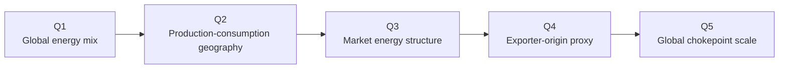
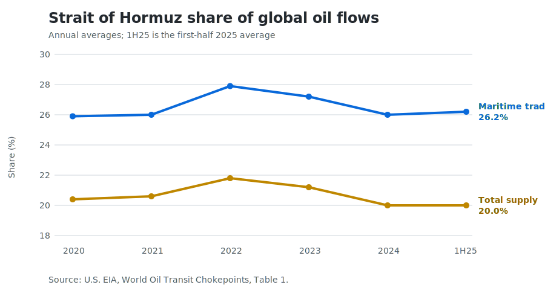

# Strait of Hormuz Energy Exposure

### A reproducible Python analysis of the global energy system, oil supply-demand geography, and an origin-based exposure proxy

[](https://github.com/ZiyuanLi-Econ/Python-Program/actions/workflows/tests.yml)


`Python 3.12` · `pandas` · `Matplotlib` · `unittest` · `GitHub Actions`

## Project overview

How important is the Strait of Hormuz to the global oil system, and which major markets appear most connected to Hormuz-related exporters?

This portfolio project answers that question in five linked stages. It starts with the 2024 global energy mix, maps the geographic mismatch between oil production and consumption, compares the energy structure of seven economies and markets, builds a deliberately limited exporter-origin proxy from UN Comtrade data, and places those results in the context of EIA chokepoint flows.

The project is designed to be readable as research and reproducible as code. Each section is an independent, tested Python module, while [`run_analysis.py`](run_analysis.py) provides one command for the complete workflow. A more detailed discussion is available in [`REPORT.md`](REPORT.md).

## Executive summary

- Global total energy supply reached **592.2 EJ in 2024**. Oil contributed **33.6%**, coal **27.9%**, and natural gas **25.1%**; together, the three fossil-fuel categories represented **86.6%**.
- Oil supply and demand were geographically misaligned. The Middle East accounted for **31.3% of production but 9.8% of consumption** (+21.5 percentage points), while Asia Pacific accounted for **7.5% of production but 39.4% of consumption** (−32.0 points).
- The ten largest producing countries supplied **74.7%** of country-level oil production, versus **64.5%** of consumption for the ten largest consuming countries.
- In the exporter-origin proxy, Hormuz-related exporters represented **94.5% of Japan's**, **71.9% of South Korea's**, **45.4% of India's**, and **36.9% of China's** reported crude-import partner totals. These figures describe exporter origin—not observed passage through the strait.
- EIA data show **20.7 million barrels per day (mb/d)** moving through Hormuz in 2024, equal to **26.0% of world maritime oil trade** and **20.0% of world total oil supply**. The first-half 2025 averages were 20.9 mb/d, 26.2%, and 20.0%, respectively.

## Analysis flow



| Section | Question | Main output | Code |
|---|---|---|---|
| Q1 | What powers the global energy system? | 2024 total supply and source shares | [`global_overview.py`](q1_global_energy_overview/global_overview.py) |
| Q2 | Where is oil produced versus consumed? | Country rankings, regional gaps, and concentration | [`production_consumption.py`](q2_production_consumption/production_consumption.py) |
| Q3 | How do major markets' energy mixes differ? | Comparable source shares for seven economies/markets | [`country_energy_structure.py`](q3_country_energy_structure/country_energy_structure.py) |
| Q4 | How connected are crude-import origins to selected exporters? | Supply-gap and exporter-origin proxies with reconciliation checks | [`oil_import_exposure.py`](q4_oil_import_dependency/oil_import_exposure.py) |
| Q5 | How large are Hormuz flows in the global oil system? | 2020–1H25 flow and global-share series | [`hormuz_chokepoints.py`](q5_hormuz_chokepoints/hormuz_chokepoints.py) |

## Q4: what the proxy means

Q4 intentionally separates three measures:

```text
Domestic supply-gap proxy (%)
    = max(oil consumption − oil production, 0) / oil consumption × 100

Origin-based Hormuz-related share (%)
    = crude imports reported from selected exporter origins / reported partner imports × 100

Combined screening proxy (percentage points)
    = supply-gap proxy × origin-based share / 100
```

The second measure uses 2024 UN Comtrade imports of crude petroleum (HS 2709). Net weight is preferred; trade value is used only when usable partner weights are unavailable. Partner totals are checked independently against each reporter's `World` row.

This is **not** a measure of physical transit through the Strait of Hormuz. Exporter origin does not identify the shipping route, Saudi Arabia and the UAE have bypass capacity, and the production-consumption gap is not observed gross imports. Missing production for Germany, Japan, and South Korea remains missing, so the combined proxy is not calculated for those markets. See the [full methodology and limitations](REPORT.md#q4-domestic-supply-gap-and-exporter-origin-proxies).

## Global chokepoint scale



*Source: U.S. EIA, World Oil Transit Chokepoints, Table 1. The final observation is a first-half 2025 average, not a full-year value.*

## Data sources

- [Energy Institute — Statistical Review of World Energy](https://www.energyinst.org/statistical-review/resources-and-data-downloads): 2025 edition snapshot (data through 2024) used for Q1–Q4.
- [UN Comtrade](https://comtradeplus.un.org/TradeFlow): 2024 annual crude-oil imports (HS 2709) for seven reporters used in Q4.
- [U.S. EIA — World Oil Transit Chokepoints](https://www.eia.gov/international/content/analysis/special_topics/World_Oil_Transit_Chokepoints/): Table 1 flows for 2020–2024 and first-half 2025 used in Q5.

Third-party raw files are **not redistributed in this repository**. Download instructions, query scope, snapshot hashes, access dates, and licensing notes are documented in [`DATA_SOURCES.md`](DATA_SOURCES.md) and [`data_raw/README.md`](data_raw/README.md). The included summary chart is an original visualisation of the cited EIA table.

## Reproduce the analysis

### 1. Clone and install

```bash
git clone https://github.com/ZiyuanLi-Econ/Python-Program.git
cd Python-Program
python -m venv .venv
```

Activate the environment:

```bash
# Windows PowerShell
.venv\Scripts\Activate.ps1

# macOS / Linux
source .venv/bin/activate
```

Then install the bounded dependency ranges:

```bash
python -m pip install --upgrade pip
python -m pip install -r requirements.txt
```

### 2. Add source data

Follow [`data_raw/README.md`](data_raw/README.md) and save these files locally:

```text
data_raw/Statistical Review of World Energy Narrow format.csv
data_raw/TradeData.csv
```

Q5 records its small EIA source table and source metadata directly in the module. Do not commit the downloaded third-party files.

### 3. Run

```bash
# Complete Q1–Q5 workflow
python run_analysis.py

# Selected sections only
python run_analysis.py --only q1 q4 q5
```

## Tests and continuous integration

The suite contains **20 focused unit tests** covering calculation logic, schema and duplicate-key validation, missing-data behaviour, rankings, share reconciliation, and EIA flow relationships.

```bash
python -m unittest discover -s tests -v
```

The same command runs on every push and pull request through [GitHub Actions](.github/workflows/tests.yml). Tests use small in-memory fixtures and do not require the excluded raw datasets.

## Repository structure

```text
.
├── q1_global_energy_overview/
│   └── global_overview.py
├── q2_production_consumption/
│   └── production_consumption.py
├── q3_country_energy_structure/
│   └── country_energy_structure.py
├── q4_oil_import_dependency/
│   └── oil_import_exposure.py
├── q5_hormuz_chokepoints/
│   └── hormuz_chokepoints.py
├── tests/
├── assets/figures/
├── data_raw/
│   └── README.md
├── .github/workflows/tests.yml
├── DATA_SOURCES.md
├── REPORT.md
├── requirements.txt
└── run_analysis.py
```

## Skills demonstrated

- Translating an economic question into a five-stage analytical workflow
- Data cleaning, validation, reshaping, aggregation, ranking, and reconciliation with `pandas`
- Clear analytical visualisation with `Matplotlib`
- Honest proxy construction, missing-data handling, and limitation disclosure
- Modular Python design with a single reproducible entry point
- Unit testing and continuous integration with GitHub Actions
- Responsible documentation of third-party data provenance and licensing

## Interpretation

The project supports two distinct conclusions. First, Hormuz is systemically important: roughly one quarter of world maritime oil trade passed through it in 2024 and first-half 2025. Second, individual-market exposure cannot be inferred from exporter origin alone. The Q4 results are therefore screening indicators that identify where deeper route, refinery, inventory, contract, and bypass-capacity analysis would be most valuable—not estimates of disruption losses.
